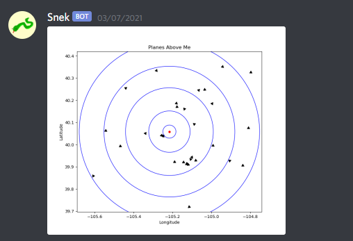

# Pythons on a Plane
## HackCU 2020 Entry
### Peyton Early, Tyler Kirkpatrick, Marceline Milligan, and Nathan Shaver

## About
Pythons on a Plane makes use of the OpenSky REST API to gather information about overhead planes. The collected data is displayed on an OLED display and and in a Discord message.

## Hardware
- Raspberry Pi Zero W
- SparkFun SAM-M8Q GPS Breakout
- SparkFun Qwiic Micro OLED Breakout
- Digilent Analog Discovery 2 (as voltage supply)

## Software Dependencies
- `discord.py`
- `matplotlib`
- `numpy`
- `pandas`
- `requests`
- `sparkfun-qwiic-micro-oled`
- `sparkfun-ublox-gps`

## Accomplishments
Ahead of this project, we had not worked much with web APIs, so making use of APIs run by OpenSky and Discord APIs was a great learning experience. Furthermore, we were excited to introduce ourselves to commonly used Python tools like NumPy and Matplotlib. Tying our code into hardware gave us the opportunity to work with the Raspberry Pi, which offered an interesting change from microcontroller development.
